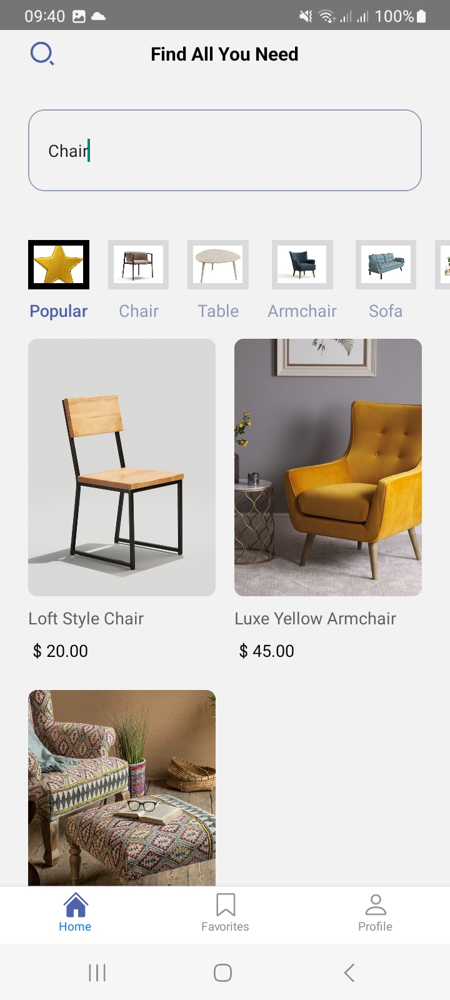
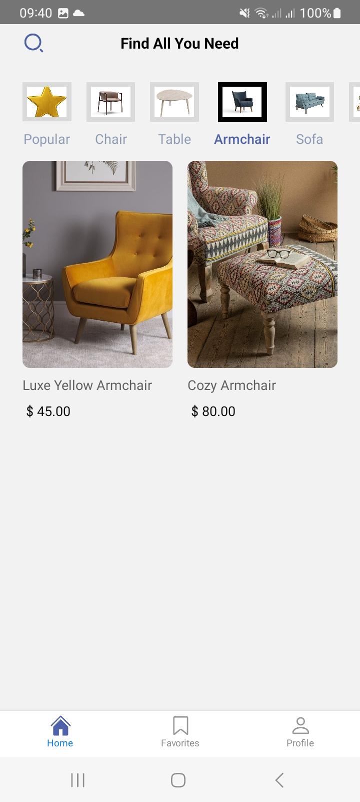
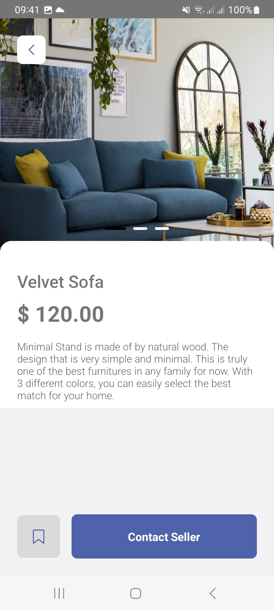

This is a new [**React Native**](https://reactnative.dev) project, bootstrapped using [`@react-native-community/cli`](https://github.com/react-native-community/cli).

# Getting Started

> **Note**: Make sure you have completed the [React Native - Environment Setup](https://reactnative.dev/docs/environment-setup) instructions till "Creating a new application" step, before proceeding.

### For Android

```bash
# using npm
npm run android

# OR using Yarn
yarn android
```

### For iOS

```bash
# using npm
npm run ios

# OR using Yarn
yarn ios
```

## Project Features

- React Navigation
- Api
- React Native Async Storage
- React Native Firebase , Authentication
- React Native Config
- Google login
- Custom icons from figma
- Redux Toolkit, React Redux
- Still in progress

## Screens

| Home With Search query                                                                            | Popular Category with Search query                                                                | ArmCair selected                                                                                  | Details Screen with Carousel                                                                      |
| ------------------------------------------------------------------------------------------------- | ------------------------------------------------------------------------------------------------- | ------------------------------------------------------------------------------------------------- | ------------------------------------------------------------------------------------------------- |
|  |  |  |  |
